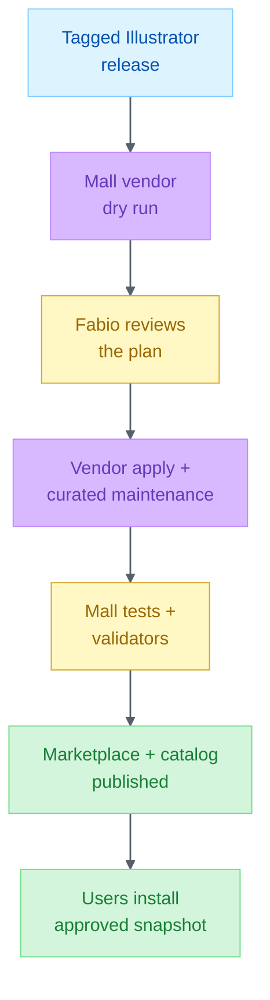

# Publishing Illustrator to the Mall

**A released Illustrator source becomes installable only after the Mall packages, validates, and publishes an approved snapshot, keeping implementation ownership separate from distribution governance.**



**Figure 1:** *The source repo owns the release; the Mall owns normalized packaging, approval, validation, and publication.*

## Ownership

| Responsibility | Owner | Evidence |
| --- | --- | --- |
| Skills, prompts, MCP declarations, release tag | Illustrator repo | `plugin.json`, `manifest.json`, `CHANGELOG.md` |
| Normalized payload and marketplace entry | Mall repo | `npm run vendor` |
| Curated publication approval | Fabio | Reviewed dry-run plan and diff |
| Catalog, trust, marketplace, generated README | Mall repo | `npm run maintain -- --curated` |
| Structural and regression gates | Mall repo | `npm run check` |

Mall scripts never approve, commit, push, or merge. Fabio retains those decisions.

## Prerequisites

1. Release Illustrator and push its tag.
2. Confirm source and Mall worktrees are clean.
3. Pull Mall `main` before packaging.
4. Use Node.js 24 or newer.

```pwsh
$source = 'C:\Development\Alex_ACT_Illustrator_Plugin'
$mall = 'C:\Development\Alex_ACT_Plugin_Mall'

git -C $source status --short
git -C $mall pull --rebase origin main
git -C $mall status --short
```

## Maintainer Refresh

Run from the Mall repository. Replace `<tag>` with the released tag, not `main`.

### 1. Preview the package

Dry run is the default:

```pwsh
cd C:\Development\Alex_ACT_Plugin_Mall

npm run vendor -- `
  --source ..\Alex_ACT_Illustrator_Plugin `
  --category data-analytics `
  --repository https://github.com/fabioc-aloha/Alex_ACT_Illustrator_Plugin `
  --ref <tag> `
  --submitted-by @fabioc-aloha `
  --evidence "Released and verified in the source repo" `
  --replace
```

Review the JSON plan. It must identify `alex-act-illustrator-plugin`, preserve the `data-analytics` category, and stay within the platform payload limit.

### 2. Obtain approval

Show Fabio the source tag and commit, planned payload path, component changes, version and file-count changes, and any new executable, network, credential, or license surface. Do not add `--apply` until Fabio approves the plan.

### 3. Apply and regenerate curated outputs

```pwsh
npm run vendor -- `
  --source ..\Alex_ACT_Illustrator_Plugin `
  --category data-analytics `
  --repository https://github.com/fabioc-aloha/Alex_ACT_Illustrator_Plugin `
  --ref <tag> `
  --submitted-by @fabioc-aloha `
  --evidence "Released and verified in the source repo" `
  --replace `
  --apply `
  --maintain
```

`--maintain` runs the curated maintenance pipeline after packaging. Running it explicitly is also valid:

```pwsh
npm run maintain -- --curated
```

### 4. Run the complete gate

```pwsh
npm run check
git diff --check
git status --short
```

Review the diff before committing. Expected changes include the Illustrator payload, marketplace entry, first-party catalog and trust outputs, and generated Mall documentation.

## Approval Gate

For repository enforcement, preview and then apply the Mall's branch-protection contract:

```pwsh
npm run admin:configure-approval
npm run admin:configure-approval -- --apply
```

Contributor plugin PRs require the validation check and CODEOWNER approval. Generated catalog-refresh paths follow their separate automation lane.

## Validation Checklist

- [ ] Illustrator source tag exists and matches `plugin.json` and `manifest.json`.
- [ ] Dry-run plan was reviewed before `--apply`.
- [ ] Fabio approved the curated publication.
- [ ] Mall payload is `plugins/data-analytics/alex-act-illustrator-plugin/`.
- [ ] Marketplace identity is `alex-act-illustrator-plugin@alex-mall`.
- [ ] `npm run maintain -- --curated` passed.
- [ ] `npm run check` passed.
- [ ] Diff contains no unrelated catalog, plugin, or trust changes.
- [ ] Commit and push remain separate, explicit maintainer actions.

## Contributor Route

External contributors use the Mall's [`CONTRIBUTING.md`](https://github.com/fabioc-aloha/Alex_Skill_Mall/blob/main/CONTRIBUTING.md) flow:

1. Run `npm run submit:prepare` in a fork.
2. Run `npm run submit:validate`, Mall tests, and validation.
3. Open a plugin-submission PR.
4. Wait for CODEOWNER review and approval.

Contributor scripts never overwrite an existing curated plugin and never publish autonomously.

## Failure And Rollback

| Failure | Action |
| --- | --- |
| Dry-run shows the wrong name, category, or component set | Stop; fix source declarations or vendor arguments. |
| `--replace` is missing | Add it only after confirming this is the existing curated Illustrator entry. |
| Maintenance changes unrelated first-party plugins | Stop; restore the Mall worktree and investigate source selection. |
| Tests or validation fail | Fix in the owning repo, rerun dry-run, and seek approval again if the payload changes. |
| Published payload is defective | Revert the Mall publication commit or re-vendor the last known-good Illustrator tag, then rerun curated maintenance and checks. |
| Source tag is wrong | Do not rewrite the tag silently; cut a corrected source release. |

## Boundaries

- Do not hand-copy plugin files into the Mall.
- Do not use the weekly external-store refresh as a substitute for curated publication.
- Do not edit generated catalog or marketplace outputs by hand.
- Do not let packaging scripts commit, push, approve, or merge.
- Do not publish from an untagged source revision.

## Would Revise If

Revisit by **2026-11-01**, or sooner if the Mall changes the `vendor` or `maintain` contract, the platform payload limit changes, or a published Illustrator release bypasses dry-run review or CODEOWNER approval.
